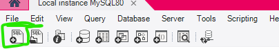

# 🍉 Bem-Estar+

<p align="center">
  
</p>

## 📌 Sobre o projeto

O **Bem-Estar+** é um site criado com o objetivo de tornar informações sobre alimentação saudável, nutrição e qualidade de vida mais simples e acessíveis.

O projeto surgiu da percepção de que muitas pessoas possuem dúvidas sobre alimentação no dia a dia, mas nem sempre encontram informações claras e de fácil compreensão.

Por isso, o site reúne notícias e conteúdos sobre alimentação e bem-estar, buscando ajudar os usuários a conhecer melhor esses assuntos e fazer escolhas mais conscientes para sua saúde.

---

## ⚙️ Funcionalidades

O **Bem-Estar+** foi desenvolvido para ser simples e fácil de utilizar, permitindo que pessoas de diferentes idades naveguem pelo conteúdo.

Entre as principais funcionalidades estão:

* 📰 Visualização de notícias sobre alimentação e saúde;
* 🔍 Pesquisa de notícias;
* 🕐 Página de últimas notícias;
* 🔥 Página com as notícias mais lidas;
* ❤️ Sistema de notícias favoritas;
* 👤 Cadastro e login de usuários;
* 🖼️ Foto de perfil;
* 💬 Área para comentários;
* 👁️ Registro de visualizações das notícias;
* ☀️ Modo claro;
* 🌙 Modo escuro;
* 📱 Layout responsivo para computadores e dispositivos móveis;
* 📖 Página com informações sobre o projeto;
* 📞 Formas de contato por Gmail e WhatsApp.

---

## 🛠️ Tecnologias utilizadas

<p align="center">


</p>

O projeto utiliza principalmente:

* **HTML5** — estrutura das páginas;
* **CSS3** — estilização e responsividade;
* **JavaScript** — interações e funcionalidades do site;
* **PHP** — comunicação entre o site e o banco de dados;
* **MySQL** — armazenamento dos usuários, notícias, comentários e demais informações;
* **Git e GitHub** — versionamento e armazenamento do projeto.

---

## 📋 Requisitos

Antes de executar o projeto, é necessário ter instalado:

* XAMPP;
* Apache;
* MySQL;
* PHP;
* Um navegador, como Google Chrome, Microsoft Edge ou Firefox.

O **Apache** e o **MySQL** podem ser iniciados diretamente pelo painel do XAMPP.

---

## 🚀 Como rodar o projeto

### 1. Baixe o projeto

No GitHub, clique no botão **Code** e depois em **Download ZIP**.

Após o download, extraia a pasta.

---

### 2. Coloque o projeto no XAMPP

Mova a pasta do projeto para:

```text
C:\xampp\htdocs\
```

A estrutura ficará semelhante a:

```text
C:\xampp\htdocs\bem-estar-mais
```

---

### 3. Inicie o XAMPP

Abra o **XAMPP Control Panel** e inicie:

```text
Apache
MySQL
```

Os dois serviços devem ficar ativos.

---

## 🗄️ Configuração do banco de dados

### 4. Acesse o phpMyAdmin

Com o Apache e o MySQL ligados, abra o navegador e acesse:

```text
http://localhost/phpmyadmin
```

---

### 5. Importe o banco de dados

O projeto possui um arquivo chamado:

```text
banco.sql
```

No phpMyAdmin:

1. Clique em **Importar**;
2. Selecione o arquivo `banco.sql`;
3. Clique em **Executar**.

O arquivo criará o banco de dados e as tabelas necessárias para o funcionamento do projeto.

<p align="center">
  
</p>

---

## 🔌 Configuração da conexão

Por segurança, os dados reais de conexão com o banco não ficam armazenados diretamente no repositório.

Localize o arquivo:

```text
conexao.example.php
```

Faça uma cópia dele e renomeie para:

```text
conexao.php
```

Depois, abra `conexao.php` e configure as informações de acordo com o seu MySQL:

```text
Servidor
Usuário
Senha
Banco
Porta
```

Se estiver utilizando a configuração padrão do XAMPP, normalmente o servidor será `localhost`.

---

## 🌐 Abrindo o site

Depois que o Apache, o MySQL e o banco de dados estiverem configurados, abra o navegador.

Acesse o projeto através do `localhost`, utilizando o caminho correspondente à pasta onde o projeto foi colocado.

Por exemplo:

```text
http://localhost/bem-estar-mais/
```

> Não abra simplesmente os arquivos do projeto clicando duas vezes neles. Como o Bem-Estar+ utiliza PHP e MySQL, o projeto deve ser executado através do servidor local do XAMPP.

---

## 📥 Como clonar o projeto

Também é possível baixar o projeto utilizando o Git.

Abra o Git Bash ou terminal e execute:

```bash
git clone https://github.com/Ana08Julia/bem-estar-mais.git
```

Depois, mova o projeto para a pasta `htdocs` do XAMPP, caso ele tenha sido clonado em outro local.

---

## 📁 Estrutura do projeto

A organização do projeto segue uma estrutura semelhante a:

```text
bem-estar-mais/
│
├── CSS/
├── HTML/
├── IMAGENS/
│   ├── BANNER DAS NOTÍCIAS/
│   ├── BANNER PÁGINA PRINCIPAL/
│   ├── CAPA DAS NOTÍCIAS/
│   ├── ÍCONES/
│   ├── LOGO/
│   ├── PÁGINA PRINCIPAL/
│   ├── PERFIL USUARIOS/
│   └── print-tutorial.png
│
├── JS/
├── NOTÍCIAS/
├── PHP/
│
├── banco.sql
├── conexao.example.php
└── README.md
```

---

## 🔮 Melhorias futuras

Apesar das funcionalidades já implementadas, o projeto ainda pode receber diversas melhorias no futuro.

Algumas ideias são:

* Adicionar mais informações às notícias;
* Criar enquetes e perguntas interativas;
* Implementar vídeos relacionados aos conteúdos;
* Melhorar pequenos detalhes da interface;
* Adicionar novas funcionalidades para os usuários;
* Continuar aprimorando a responsividade;
* Melhorar a experiência de navegação pelo site.

---

## 📚 O que aprendemos

Por ser nosso primeiro projeto desse tipo, o desenvolvimento do **Bem-Estar+** proporcionou diversos aprendizados.

Durante o projeto, aprendemos a estruturar melhor páginas utilizando HTML e a trabalhar com estilização e organização de elementos utilizando CSS.

Também aprendemos a criar recursos como modo claro e escuro, páginas de cadastro e login e diferentes formas de interação com o usuário.

Além disso, tivemos contato com PHP e banco de dados MySQL, aprendendo conceitos importantes sobre conexão com o banco, armazenamento de informações, usuários e notícias.

O projeto também mostrou que ainda existem muitas possibilidades de melhoria e novos conhecimentos a serem adquiridos durante nossa evolução na área de desenvolvimento web.

---

## 👩‍💻 Autores

Projeto desenvolvido por:

* **Aline Rodrigues Silva**
* **Ana Júlia Alves Pereira**
* **Fellipe Martins Gomes Carvalho**

**Turma de Tecnologia em Informática para Internet — Vespertino**

**Senac DF**

---

<p align="center">
  🍉 <strong>Bem-Estar+</strong> — Informação para uma vida mais saudável.
</p>
